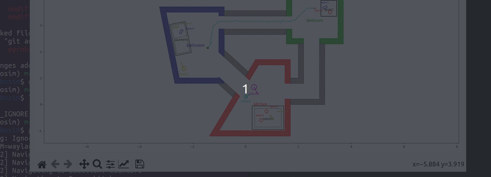

## ROS 2 Robot Simulator with custom A* Implementation
The new algorithm can be found in `src/pyrobosim/pyrobosim/navigation/a_star_mcschwartzman.py`

### To test:
1. Clone to a valid colcon ws
2. colcon build
3. Run `python examples/demo.py --multirobot`
4. Select `robot2`. This robot has been configured to use the new a* planner.
5. Select a random goal and hit "navigate" to see the planner in action

### To-do:
- Build waypoint reducer to smooth path
- Implement additional heuristic options
- Add configurable diagonal movement